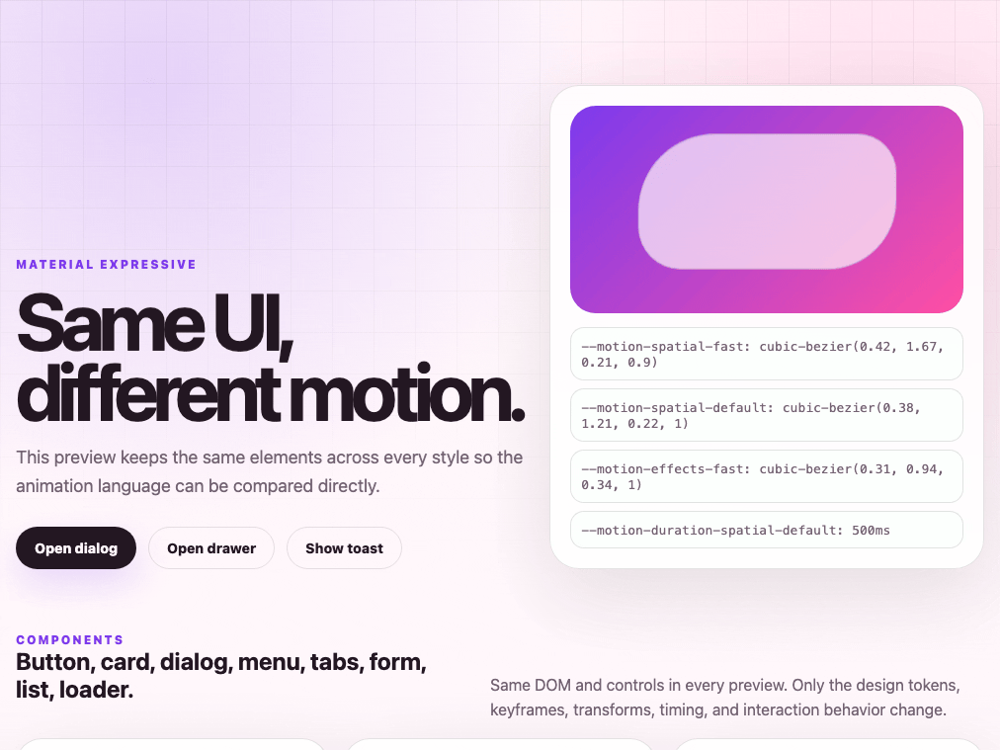
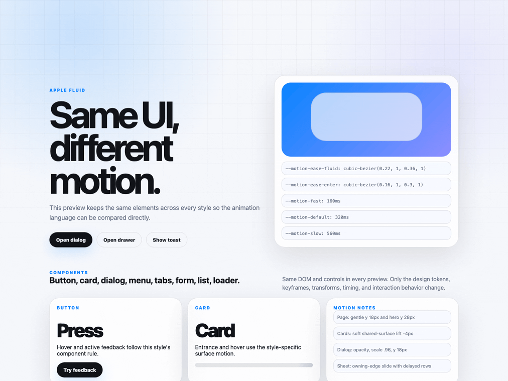
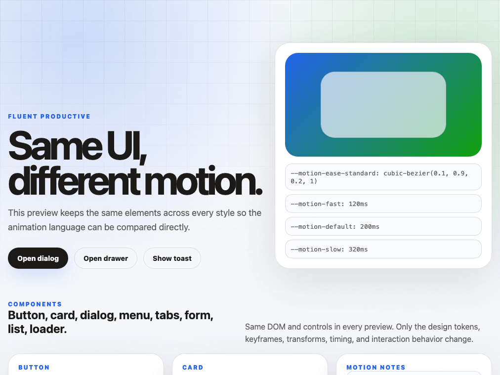
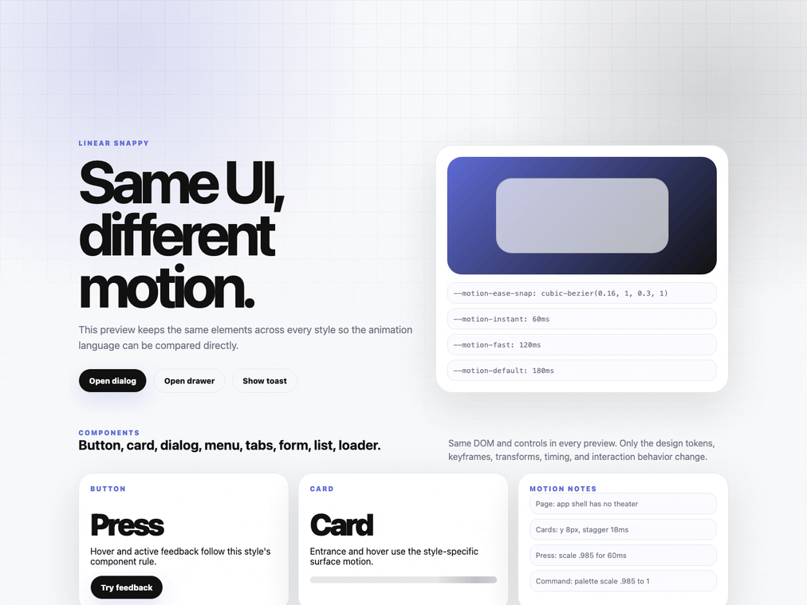
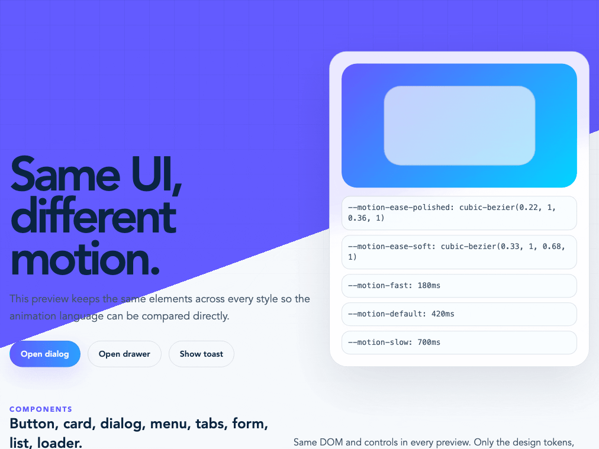
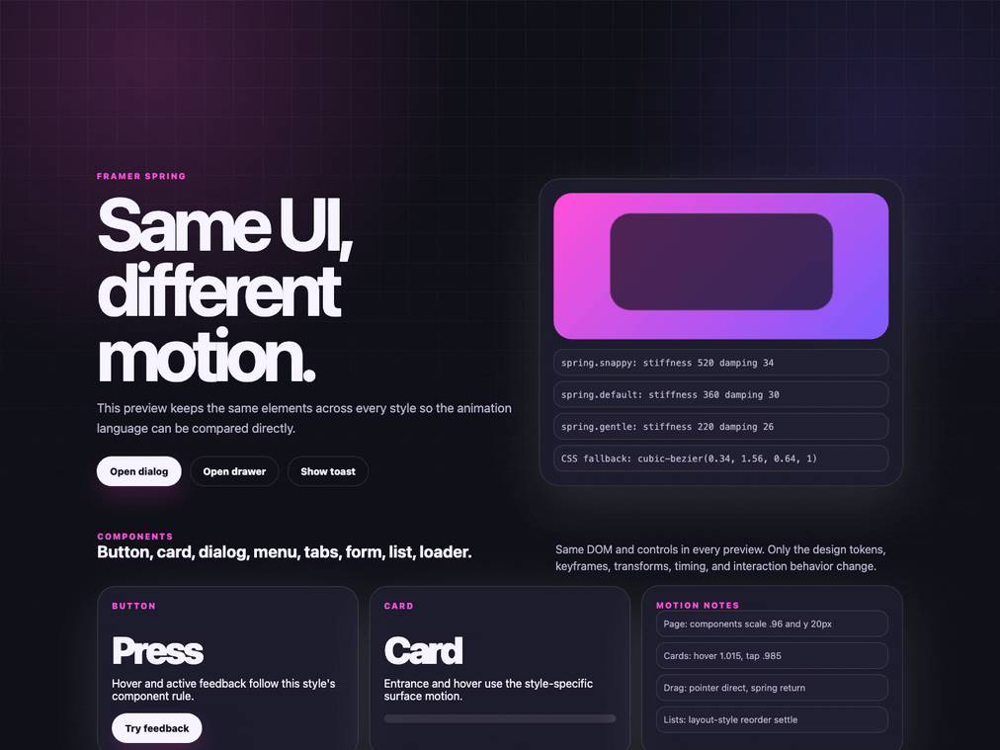
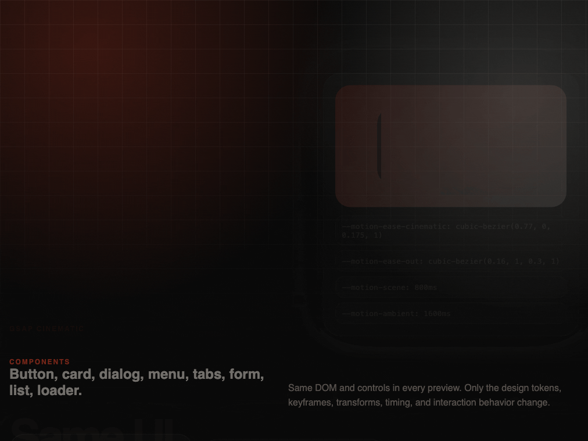
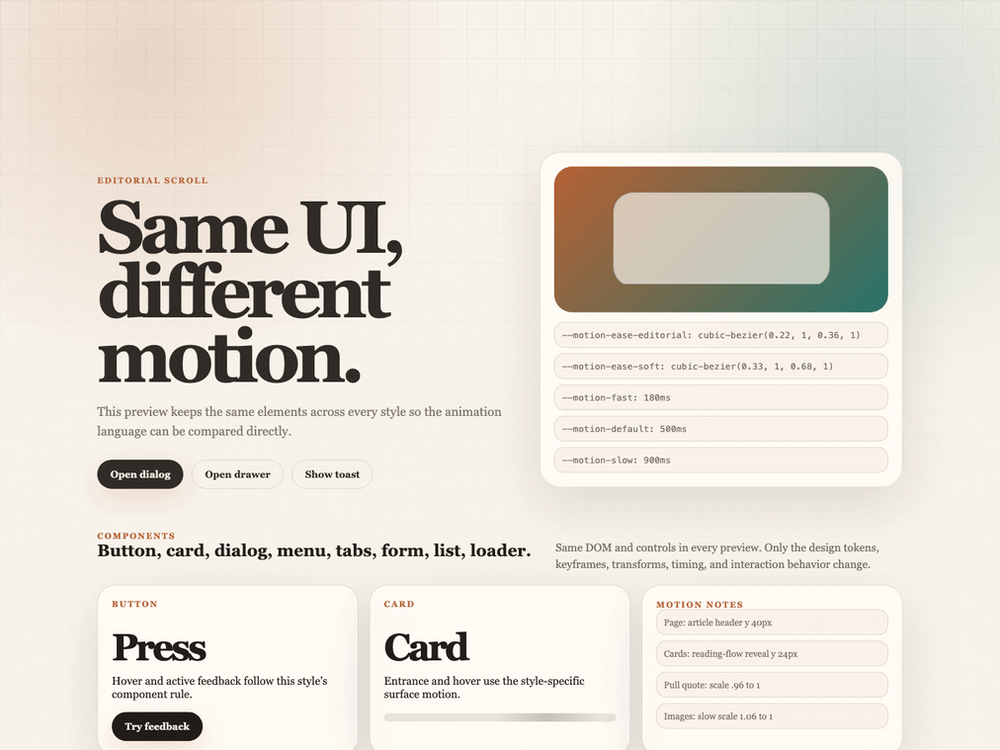

# awesome-motion.md



مجموعة منتقاة من ملفات `MOTION.md` تساعد وكلاء الذكاء الاصطناعي على إنشاء حركات واجهات مستخدم جذابة وغير مملة.

[English](README.md) | [中文版](README.zh-CN.md) | [日本語](README.ja.md) | [한국어](README.ko.md)

## معرض المعاينات

تستخدم كل معاينة عناصر واجهة المستخدم نفسها، بينما يتم توليد الأسلوب البصري وسلوك الحركة من ملف `MOTION.md` الخاص بها.

<table width="100%">
  <tr><td width="100%"><strong>Material Expressive</strong><br /></td></tr>
  <tr><td width="100%"><strong>Apple Fluid</strong><br /></td></tr>
  <tr><td width="100%"><strong>Fluent Productive</strong><br /></td></tr>
  <tr><td width="100%"><strong>Carbon Enterprise</strong><br /></td></tr>
  <tr><td width="100%"><strong>Linear Snappy</strong><br /></td></tr>
  <tr><td width="100%"><strong>Stripe Polished</strong><br /></td></tr>
  <tr><td width="100%"><strong>Vercel Minimal</strong><br /></td></tr>
  <tr><td width="100%"><strong>Framer Spring</strong><br /></td></tr>
  <tr><td width="100%"><strong>GSAP Cinematic</strong><br /></td></tr>
  <tr><td width="100%"><strong>Game Impact</strong><br /></td></tr>
  <tr><td width="100%"><strong>Glitch Cyberpunk</strong><br /></td></tr>
  <tr><td width="100%"><strong>Editorial Scroll</strong><br /></td></tr>
</table>

## ما هذا المشروع؟

`MOTION.md` هو دليل قواعد لتصميم الحركة مخصص لوكلاء البرمجة بالذكاء الاصطناعي مثل Cursor و Claude Code و OpenCode.

بدلا من أن تطلب من الذكاء الاصطناعي "أضف بعض الحركة" وتحصل على تأثيرات fade عامة، تمنحه مواصفة حركة واضحة تشمل منحنيات easing، ورموز المدة، وحركات الدخول، وحالات hover، وسلوكيات تعتمد على التمرير، وانتقالات الخروج، وقواعد الوصول، والأنماط التي يجب تجنبها.

## بنية المشروع

```txt
awesome-motion-md/
├── assets/                # صور GIF تجريبية وموارد بصرية
├── motion-md/            # أدلة قواعد أنماط الحركة
├── docs/                 # أدلة وأمثلة
├── README.md             # README باللغة الإنجليزية
├── README.zh-CN.md       # README باللغة الصينية
├── README.ja.md          # README باللغة اليابانية
├── README.ko.md          # README باللغة الكورية
└── README.ar.md          # README باللغة العربية
```

## أنماط الحركة

توجد أنماط الحركة في `motion-md/`، ويأتي كل نمط كملف `MOTION.md` مستقل ومتكامل.

الأنماط المتاحة:

```txt
motion-md/
├── material-expressive/MOTION.md
├── apple-fluid/MOTION.md
├── fluent-productive/MOTION.md
├── carbon-enterprise/MOTION.md
├── linear-snappy/MOTION.md
├── stripe-polished/MOTION.md
├── vercel-minimal/MOTION.md
├── framer-spring/MOTION.md
├── gsap-cinematic/MOTION.md
├── game-impact/MOTION.md
├── glitch-cyberpunk/MOTION.md
└── editorial-scroll/MOTION.md
```

| النمط | الوصف |
| --- | --- |
| `material-expressive` | حركة مستوحاة من الفيزياء ومبنية على نظام expressive spring في Material Design. |
| `apple-fluid` | حركة هادئة ومستمرة وفاخرة مستوحاة من إحساس Apple المكاني والتفاعل المباشر. |
| `fluent-productive` | حركة سريعة ووظيفية وواضحة الطبقات لواجهات الإنتاجية. |
| `carbon-enterprise` | حركة دقيقة وسهلة الوصول مناسبة للمنتجات المؤسسية المعقدة. |
| `linear-snappy` | حركة SaaS فائقة السرعة بمسافات صغيرة وتغيرات حالة واضحة. |
| `stripe-polished` | حركة مصقولة لصفحات الهبوط تركز على العمق، والتتابع، والجودة التجارية. |
| `vercel-minimal` | حركة مقيدة لأدوات المطورين تناسب الواجهات الداكنة والتغذية الراجعة الدقيقة. |
| `framer-spring` | أنماط حركة تتمحور حول spring وال gestures وحركات التخطيط. |
| `gsap-cinematic` | حركة سينمائية قائمة على timeline لصفحات تسويق عالية التأثير. |
| `game-impact` | حركة تغذية راجعة شبيهة بالألعاب تتضمن التمهيد، والتأثير، والمكافأة. |
| `glitch-cyberpunk` | حركة neon و scanline و glitch مع ضوابط وصول. |
| `editorial-scroll` | حركة سردية تعتمد على التمرير للمقالات وصفحات الإطلاق وتجارب scrollytelling. |

## الهدف

جعل الواجهات التي يولدها الذكاء الاصطناعي تبدو مقصودة، ومعبرة، وحية.
