# awesome-motion.md


一个 `MOTION.md` 精选集合，用来帮助 AI Agent 生成更有视觉冲击力、不呆板的 UI 动画。

## 演示

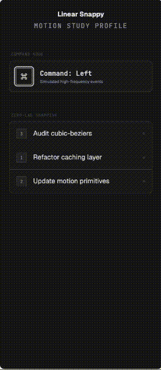


## 预览画廊

每个预览都使用相同的 UI 元素，但视觉风格和动画行为都根据各自的 `MOTION.md` 生成。

| Material Expressive | Apple Fluid |
| --- | --- |
| 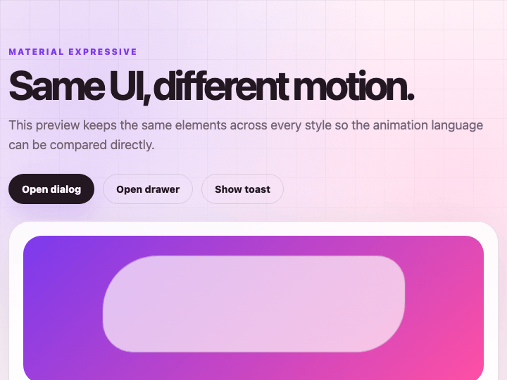 | 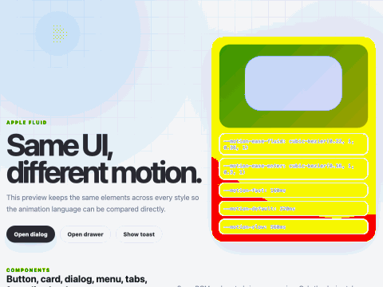 |

| Fluent Productive | Carbon Enterprise |
| --- | --- |
| 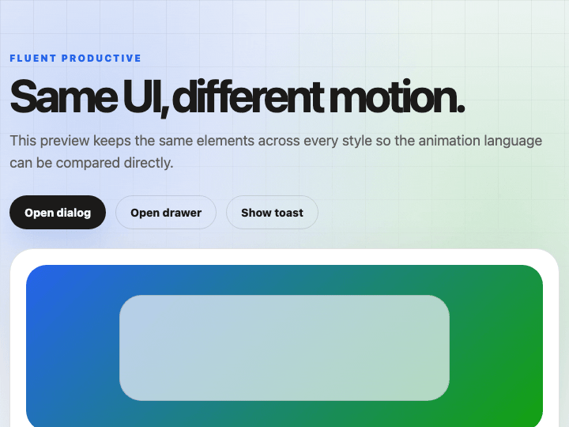 | 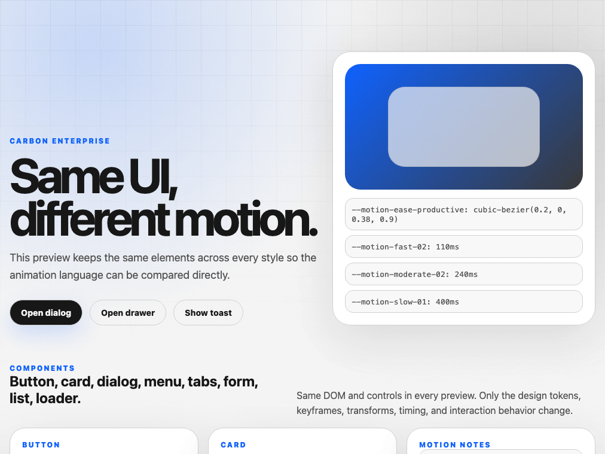 |

| Linear Snappy | Stripe Polished |
| --- | --- |
| 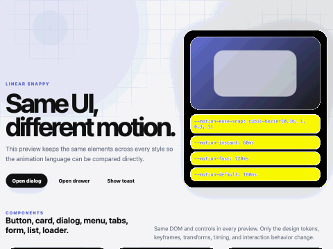 | 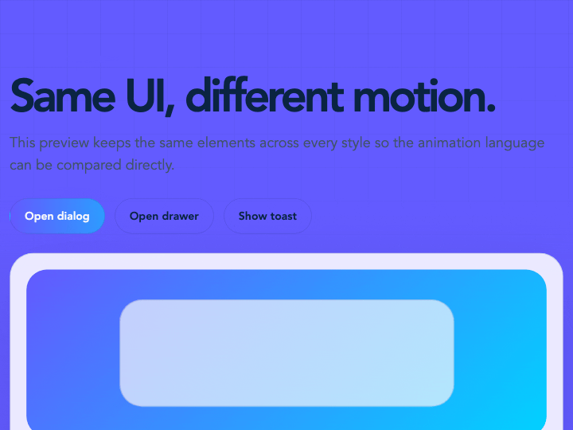 |

| Vercel Minimal | Framer Spring |
| --- | --- |
| 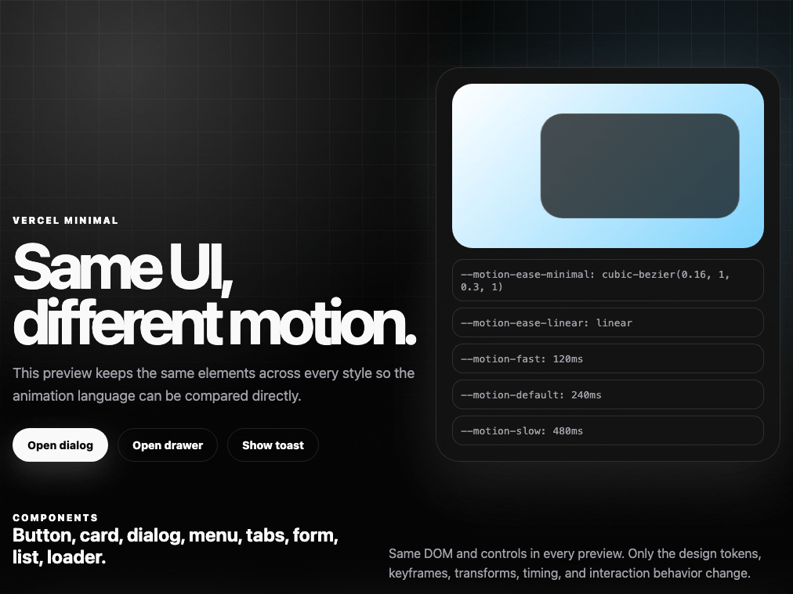 | 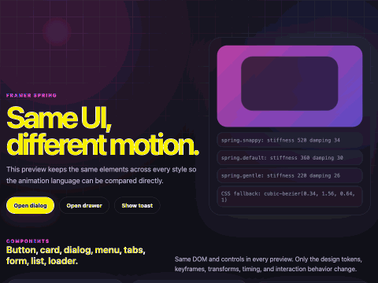 |

| GSAP Cinematic | Game Impact |
| --- | --- |
|  | 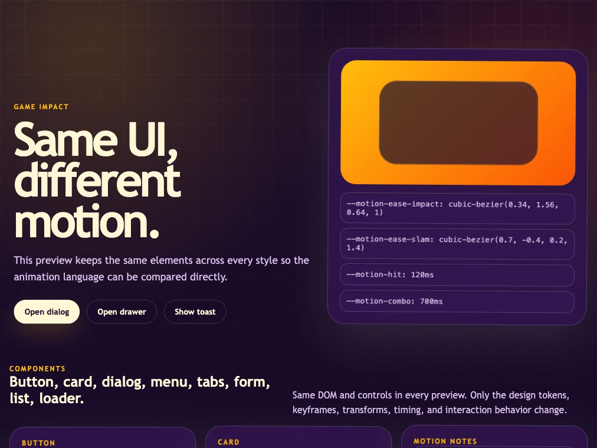 |

| Glitch Cyberpunk | Editorial Scroll |
| --- | --- |
| 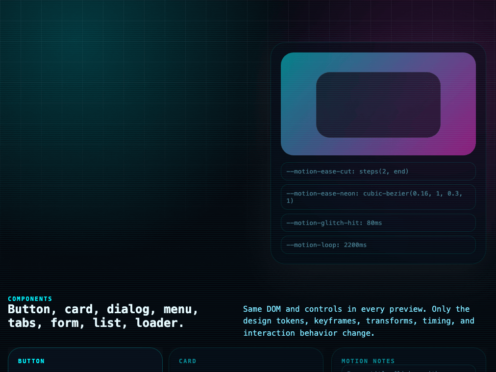 | 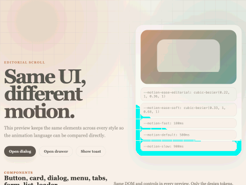 |

## 这是什么？

`MOTION.md` 是写给 Cursor、Claude Code、OpenCode 等 AI 编程 Agent 的动画设计规则文档。

它不是简单地告诉 AI “加点动画”，而是提供一套明确的运动规范：缓动曲线、动画时长、入场动画、悬停状态、滚动触发、退出动画、可访问性规则和禁止项。

## 项目结构

```txt
awesome-motion-md/
├── asset/                # 演示 GIF 与视觉资源
├── motion-md/            # 各种动画风格规则
├── docs/                 # 使用指南与示例
├── README.md             # 英文 README
└── README.zh-CN.md       # 中文 README
```

## 动画风格

所有动画风格会放在 `motion-md/` 目录中，每个风格都是一个完整独立的 `MOTION.md` 规则文件。

已有风格：

```txt
motion-md/
├── material-expressive/MOTION.md
├── apple-fluid/MOTION.md
├── fluent-productive/MOTION.md
├── carbon-enterprise/MOTION.md
├── linear-snappy/MOTION.md
├── stripe-polished/MOTION.md
├── vercel-minimal/MOTION.md
├── framer-spring/MOTION.md
├── gsap-cinematic/MOTION.md
├── game-impact/MOTION.md
├── glitch-cyberpunk/MOTION.md
└── editorial-scroll/MOTION.md
```

| 风格 | 描述 |
| --- | --- |
| `material-expressive` | 基于 Material Design 表现型弹簧系统的物理感动效风格。 |
| `apple-fluid` | 安静、连续、有高级感的空间动效，强调自然过渡和直接操控。 |
| `fluent-productive` | 面向生产力界面的快速、功能型、层级清晰动效。 |
| `carbon-enterprise` | 适合复杂企业产品的精确、克制、可访问动效。 |
| `linear-snappy` | 极快响应的 SaaS 动效，小位移、短时长、状态变化清晰。 |
| `stripe-polished` | 适合商业落地页的精致动效，强调层次、错峰和高级质感。 |
| `vercel-minimal` | 克制的开发者工具动效，适合暗色界面和细微反馈。 |
| `framer-spring` | 以弹簧、手势、布局动画和共享元素转场为核心的动效。 |
| `gsap-cinematic` | 基于时间线和滚动编排的电影感高冲击力动效。 |
| `game-impact` | 游戏化反馈动效，包含蓄力、冲击、回弹和奖励效果。 |
| `glitch-cyberpunk` | 霓虹、扫描线、故障风动效，并包含可访问性限制。 |
| `editorial-scroll` | 适合文章、发布页和叙事页面的滚动叙事动效。 |

## 参考资料

- [`docs/material-motion-reference.md`](docs/material-motion-reference.md)：提炼后的 Material Motion 参考规则，用于构建 `material-expressive` 风格。

## 目标

让 AI 生成的界面不再只有平淡的 `fadeIn`，而是拥有明确风格、节奏和表现力的动效系统。
